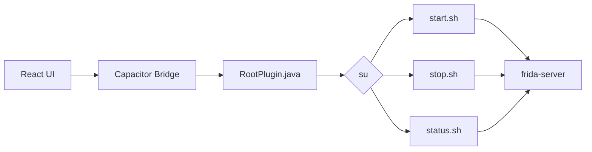

<p align="center">
  
</p>

<h1 align="center">Frida Manager</h1>

<p align="center">
  
  
  
  
  
</p>

<p align="center">
  A proof-of-concept Android application for managing a root-level Frida server through a Magisk module.
</p>

---

## Overview

Frida Manager provides a simple Android interface for controlling a `frida-server` instance installed through a Magisk module.

The application uses React, TypeScript, Vite, Capacitor, Java, and `su` to communicate with the module.

### Features

- Start Frida Server
- Stop Frida Server
- Check Frida Server status
- Test the Android bridge

## Architecture



See the [Architecture](docs/architecture.md) documentation for details.

## Project Structure

```text
FridaManager/
├── app/
├── module/
├── docs/
└── README.md
```

## Requirements

- Rooted Android device
- Magisk
- Node.js and npm
- Android SDK
- Compatible JDK

The Magisk module is expected at:

```text
/data/adb/modules/fridamanager/
```

## Development

```bash
cd app
npm install
npx cap sync android
npx cap open android
```

Or build with:

```bash
cd android
./gradlew assembleDebug
```

See the [Development Guide](docs/development.md) for more information.

## Testing

See the [Testing Guide](docs/testing.md).

## Documentation

- [Architecture](docs/architecture.md)
- [Android Plugin](docs/android-plugin.md)
- [Magisk Module](docs/magisk-module.md)
- [Development](docs/development.md)
- [Testing](docs/testing.md)

## Limitations

- Proof-of-concept
- Root access is required
- Manages a single `frida-server` instance
- Requires the Magisk module at `/data/adb/modules/fridamanager/`
- Frida Server management relies on module shell scripts

## Tech Stack

**Frontend:** React, TypeScript, Vite

**Android:** Java, Android SDK, Capacitor

**Root / Module:** Magisk, shell scripts

**Instrumentation:** Frida Server

## License

This project is licensed under the [MIT License](LICENSE).
