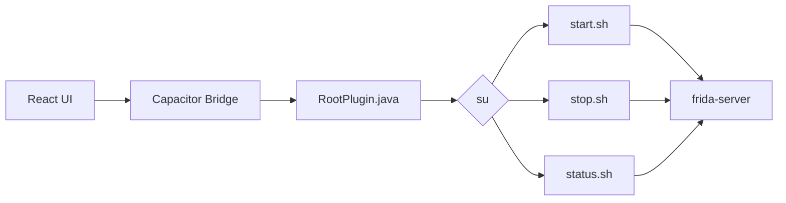

<p align="center">
  
</p>

<h1 align="center">Frida Manager</h1>

<p align="center">
  
  
  
  
  
</p>

<p align="center">
  A small Android application for managing a root-level Frida server through a Magisk module.
</p>

---

## Overview

Frida Manager is an Android application built with React, TypeScript, and Capacitor that provides a simple interface for controlling a `frida-server` instance installed through a Magisk module.

The application communicates with native Android code through a custom Capacitor plugin. The plugin uses `su` to execute shell scripts provided by the Magisk module.

The current implementation supports:

- Starting Frida Server
- Stopping Frida Server
- Checking Frida Server status
- Testing the Android ↔ JavaScript bridge

The project has two main parts:

| Part | Location | Responsibility |
| --- | --- | --- |
| Android app | `app/` | React UI, Capacitor integration, and native Android plugin |
| Magisk module | `module/` | Frida binary and scripts used to start, stop, and check Frida Server |

---

## Architecture

The application uses a simple bridge between the React frontend and the Magisk module:



The React application registers the native plugin as:

```typescript
const Root = registerPlugin("Root");
```

The Android side exposes:

```text
Root.test()
Root.start()
Root.stop()
Root.status()
```

The plugin executes the corresponding scripts inside the Magisk module:

```text
/data/adb/modules/fridamanager/scripts/
```

---

## Project Structure

```text
FridaManager/
├── app/
│   ├── android/
│   │   └── ...
│   ├── src/
│   │   ├── App.tsx
│   │   ├── App.css
│   │   ├── index.css
│   │   └── main.tsx
│   └── ...
│
├── module/
│   ├── bin/
│   │   └── frida-server
│   └── scripts/
│       ├── start.sh
│       ├── stop.sh
│       └── status.sh
│
└── README.md
```

---

## Magisk Module

The Android application expects the Magisk module to be installed at:

```text
/data/adb/modules/fridamanager/
```

The relevant module structure is:

```text
/data/adb/modules/fridamanager/
├── bin/
│   └── frida-server
└── scripts/
    ├── start.sh
    ├── stop.sh
    └── status.sh
```

### Start Script

`start.sh` locates the Frida binary relative to the module's script directory:

```sh
MODDIR=${0%/*}
FRIDA_BIN="$MODDIR/../bin/frida-server"
```

It checks whether Frida is already running, verifies that the binary exists, makes it executable, starts it, and then verifies that the process is running.

### Stop Script

`stop.sh` checks whether `frida-server` is running and terminates it using:

```sh
pkill frida-server
```

It then checks whether the process successfully stopped.

### Status Script

`status.sh` checks for the `frida-server` process using:

```sh
pidof frida-server
```

The script reports either:

```text
running (PID)
```

or:

```text
stopped
```

---

## Android Plugin

The native Android side uses a custom Capacitor plugin named `Root`.

```java
@CapacitorPlugin(name = "Root")
public class RootPlugin extends Plugin
```

The plugin exposes four methods:

| Method | Script / Action | Purpose |
| --- | --- | --- |
| `Root.test()` | Native log | Test the Capacitor bridge |
| `Root.start()` | `start.sh` | Start Frida Server |
| `Root.stop()` | `stop.sh` | Stop Frida Server |
| `Root.status()` | `status.sh` | Check Frida Server status |

Scripts are executed through:

```text
su -c
```

using the module path:

```text
/data/adb/modules/fridamanager/scripts/
```

The plugin returns the script output and exit code to the React application.

---

## Application Flow

### Start Frida

```text
Start Frida
    ↓
Root.start()
    ↓
RootPlugin.java
    ↓
su -c start.sh
    ↓
frida-server starts
    ↓
Root.status()
    ↓
UI updates
```

### Stop Frida

```text
Stop Frida
    ↓
Root.stop()
    ↓
RootPlugin.java
    ↓
su -c stop.sh
    ↓
frida-server stops
    ↓
Root.status()
    ↓
UI updates
```

### Check Status

The **Check Status** button can be used to manually refresh the current Frida Server state.

Start, Stop, and Android Bridge Test operations also perform a status check afterward so that the UI reflects the actual process state rather than assuming that an operation succeeded.

---

## Requirements

- Rooted Android device
- Magisk
- A working `su` implementation
- Frida Server
- Node.js and npm
- Android SDK
- JDK compatible with the project's Android/Gradle configuration

The application requires root access because the native plugin executes the Magisk module scripts through `su`.

---

## Running Locally

Install the frontend dependencies:

```bash
cd app
npm install
```

Synchronize the Capacitor Android project:

```bash
npx cap sync android
```

Open the Android project:

```bash
npx cap open android
```

Or build the Android project from the command line:

```bash
cd android
./gradlew assembleDebug
```

---

## Installing the Module

The module files need to be installed so that the following paths exist:

```text
/data/adb/modules/fridamanager/bin/frida-server
/data/adb/modules/fridamanager/scripts/start.sh
/data/adb/modules/fridamanager/scripts/stop.sh
/data/adb/modules/fridamanager/scripts/status.sh
```

The scripts and Frida binary should be executable:

```bash
chmod 755 /data/adb/modules/fridamanager/scripts/*.sh
chmod 755 /data/adb/modules/fridamanager/bin/frida-server
```

---

## Testing

After installing the application and Magisk module:

1. Open Frida Manager.
2. Press **Test Android Bridge**.
3. Press **Check Status**.
4. Press **Start Frida**.
5. Confirm that the status changes to `running (PID)`.
6. Press **Stop Frida**.
7. Confirm that the status changes to `stopped`.

The bridge test confirms that the React application can communicate with the native Android Capacitor plugin.

---

## Current Limitations

- The application currently manages a single `frida-server` instance.
- Root access is required for script execution.
- The application expects the Magisk module to exist at `/data/adb/modules/fridamanager/`.
- Frida Server management currently relies on the shell scripts provided by the module.
- The project is still under active development.

---

## Tech Stack

**Frontend:** React, TypeScript, Vite

**Android:** Java, Android SDK, Capacitor

**Root / Module:** Magisk, POSIX shell scripts

**Instrumentation:** Frida Server

---

## License

See [LICENSE](LICENSE) for the project license.
