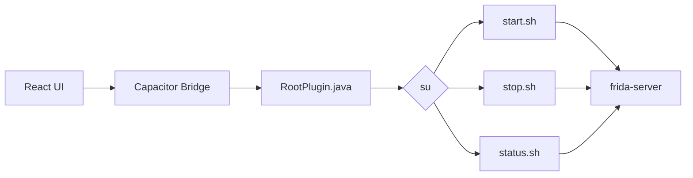

# Architecture

Frida Manager uses a simple bridge between the React frontend, the native Android plugin, and the Frida Server managed by the Magisk module.



## Application Flow

```text
React UI
   ↓
Capacitor Bridge
   ↓
RootPlugin
   ↓
su
   ↓
Magisk Module Scripts
   ↓
Frida Server
```

The native plugin is registered in React as:

```ts
const Root = registerPlugin("Root");
```

The available methods are:

```text
Root.test()
Root.start()
Root.stop()
Root.status()
```

The module scripts are located at:

```text
/data/adb/modules/fridamanager/scripts/
```
